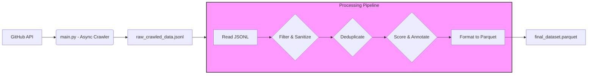

# Tadpole : GitHub Code Dataset Pipeline

[](https://opensource.org/licenses/MIT) [](https://www.python.org/) []()

**Tadpole** is a prototype data pipeline designed to crawl, process, and curate high-quality code datasets from GitHub, specifically focusing on building reliable inputs for large language model (LLM) pre-training and fine-tuning. This project demonstrates an end-to-end approach, from data acquisition to filtering, sanitization, scoring, and final formatting, emphasizing data quality, efficiency, and considerations for scalability.

## Overview

Building safe and capable AI models requires vast amounts of high-quality data. Sourcing and processing code data at scale presents unique challenges, including managing API rate limits, ensuring data integrity, removing sensitive information, filtering low-quality samples, and handling duplicates.

Tadpole tackles these challenges through a multi-stage pipeline:

1. **Asynchronous Crawling:** Efficiently searches and retrieves code files from GitHub using its API, respecting rate limits and handling network operations concurrently.
2. **Filtering & Sanitization:** Applies rules to filter irrelevant files (size, path, lines) and scans content for potential PII or secrets.
3. **Deduplication:** Implements exact content deduplication using SHA256 hashing to reduce redundancy.
4. **Scoring & Annotation:** Applies basic heuristics to assess code quality and adds relevant metadata.
5. **Formatting:** Outputs the curated dataset into Apache Parquet format, suitable for downstream processing and analysis in large-scale systems.

This project serves as a practical demonstration of building data pipelines for AI, focusing on the principles required for creating valuable and safe datasets.

## Key Features

- **Asynchronous GitHub Crawler:** Uses `aiohttp` and `asyncio` for efficient, non-blocking I/O when interacting with the GitHub API.
- **Configurable Search:** Filters repositories based on language, stars, recency, and required licenses (SPDX identifiers).
- **Multi-Stage Processing Pipeline:** Decouples crawling from processing, allowing for modularity and clearer logic (Crawl -> Filter/Sanitize -> Score/Annotate -> Format).
- **Data Quality Focus:**
  - **Filtering:** Removes files based on size, line count, path patterns, and target extensions.
  - **Sanitization:** Basic PII (email) and secret (private key header) detection using regex.
  - **Deduplication:** Exact content deduplication via SHA256 hashing.
- **Heuristic Scoring:** Simple quality scoring based on code density, comment ratio, and test keyword presence.
- **Efficient Output Format:** Saves the final dataset as Apache Parquet for efficient storage and downstream use with tools like Spark, Pandas, or BigQuery.
- **Rate Limit Handling:** Implements basic rate limit detection and asynchronous sleep/retry logic.
- **Concurrency Control:** Uses `asyncio.Semaphore` to limit concurrent API requests.

## Architecture

The pipeline consists of two main components executed sequentially:

1. **`main.py` (Crawler Stage):**

   - Takes search criteria from `settings.py`.
   - Queries GitHub Search API.
   - Fetches repository trees and file blobs asynchronously.
   - Applies initial file relevance filters (`is_file_relevant`).
   - Writes raw file content and metadata to `raw_crawled_data.jsonl`.

2. **`process_pipeline.py` (Processing Stages):**
   - Reads `raw_crawled_data.jsonl` line by line.
   - **Stage 1 (Filter, Sanitize, Deduplicate):**
     - Applies line count filter.
     - Calculates content hash.
     - Checks against seen hashes for duplicates.
     - Runs PII/secret scanning (`sanitize_content`).
     - Adds hash and findings to the record.
   - **Stage 2 (Score, Annotate):**
     - Calculates quality heuristics (density, comment ratio, test keywords).
     - Assigns a `quality_score`.
     - Adds annotations.
   - **Stage 3 (Format):**
     - Collects processed records.
     - Converts the data to a PyArrow Table.
     - Writes the table to `final_dataset.parquet` using Snappy compression.



## Setup

1. **Clone the repository:**

   ```
   git clone git@github.com:nas-tabchiche/tadpole.git
   cd tadpole
   ```

2. **Install the project's dependencies:**

   ```
   uv sync
   ```

3. **Get GitHub token:** Create a [Personal Access Token (PAT)](https://docs.github.com/en/authentication/keeping-your-account-and-data-secure/managing-your-personal-access-tokens "null") with necessary scopes (e.g., `public_repo`).
4. **Set environment variable:** Make the token available. Replace `"your_personal_access_token"` with your actual token.

   - Linux/macOS:

     ```
     export GITHUB_TOKEN="your_personal_access_token"
     ```

   - Windows (Command Prompt):

     ```
     set GITHUB_TOKEN="your_personal_access_token"
     ```

   - Windows (PowerShell):

     ```
     $env:GITHUB_TOKEN="your_personal_access_token"
     ```

## Usage

1. **Configure settings (Optional):** Modify parameters in `settings.py` (e.g., `TARGET_LANGUAGE`, `MIN_STARS`, `MAX_REPOS_TO_PROCESS`, filenames).
2. **Run the Crawler:**

   ```
   uv run main.py
   ```

   This will search GitHub and create the `raw_crawled_data.jsonl` file. Monitor the console output and `crawler_debug.log`.

3. **Run the processing pipeline:**

   ```
   uv run process_pipeline.py
   ```

   This reads the raw data, processes it through the defined stages, and creates the `final_dataset.parquet` file. Monitor the console output and `pipeline_debug.log`.

4. **Inspect Output:** Use tools compatible with Apache Parquet (e.g., Pandas in Python, dedicated Parquet viewers) to inspect `final_dataset.parquet`.

## Pipeline Details

- **Filtering:** Currently filters based on file extension, max size, min line count, and excluded directory patterns defined in `settings.py`.
- **Sanitization:** Uses regex in `helpers.sanitize_content` to find potential emails and private key headers. This is basic and should be expanded for production use.
- **Deduplication:** Uses SHA256 hash of file content for exact deduplication. The scope (`file` or `repo`) can be set in `settings.py`.
- **Scoring:** Assigns a score (0-1) based on simple heuristics (code density, comment ratio, test keyword presence). This serves as a placeholder for more sophisticated quality assessment (e.g., static analysis, model-based scoring).
- **Output** Schema **(Parquet):** The final Parquet file aims to contain columns like: `repo_url`, `path`, `size`, `license`, `processed_content_hash`, `sanitization_findings`, `line_count`, `quality_score`, `annotations`, `content`.

## Scaling and Future Work

This prototype demonstrates core concepts, but scaling to petabytes and achieving production-grade quality requires further development:

- **Distributed Processing:** Replace the single-node `process_pipeline.py` with distributed frameworks like **Apache Spark**, **Ray**, or **Apache Flink** to handle massive datasets efficiently across multiple machines. The current pipeline stages map well to transformations in these frameworks.
- **Advanced Deduplication:** Implement near-duplicate detection using techniques like **MinHash (LSH)** to identify and handle semantically similar but not identical code snippets, which is crucial for training data quality.
- **Sophisticated Filtering/Scoring:**
  - Integrate static analysis tools (e.g., linters, complexity checkers) for better quality heuristics.
  - Use model-based approaches (e.g., smaller language models) to score code quality, relevance, or toxicity.
  - Implement more robust PII/secret detection libraries (e.g., `detect-secrets`).
- **Workflow Orchestration:** Use tools like **Airflow**, **Prefect**, or **Kubeflow Pipelines** to manage dependencies, scheduling, retries, and monitoring of the multi-stage pipeline.
- **Robust Error Handling & Monitoring:** Implement comprehensive error handling, dead-letter queues for failed records, and monitoring dashboards (e.g., using Prometheus/Grafana) for pipeline health and performance.
- **Scalable Storage:** Utilize cloud object storage (S3, GCS, Azure Blob Storage) for intermediate and final datasets instead of local files.
- **Incremental crawling**: Re-crawling and processing all repositories repeatedly is highly inefficient and costly in terms of API usage and compute. Implement state management. Store metadata about processed repositories and files (e.g., last processed commit SHA, file etags). During subsequent runs, query the GitHub API for repositories/files updated _since_ the last run, or check etags to see if content has changed before re-downloading. This significantly reduces redundant work.

- **Multimodality:** Code repositories contain more than just source code (e.g., Markdown documentation, issue discussions, commit messages, images). These can also be valuable data sources.
